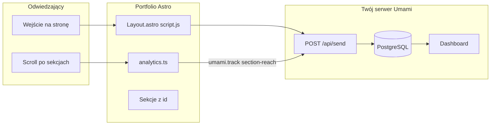
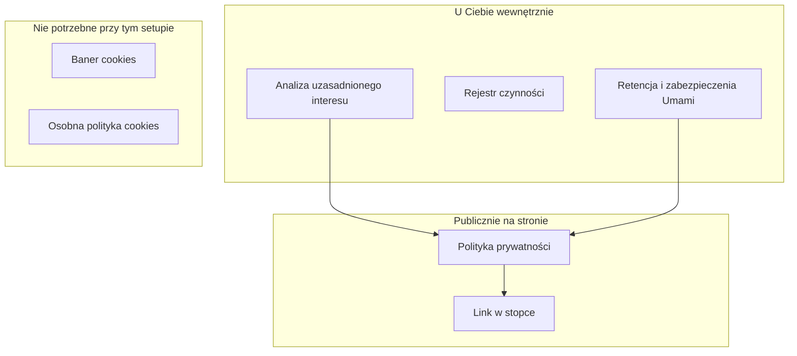

# Plan integracji Umami Analytics

## Kontekst projektu

- **Stack:** Astro 6, statyczny build do [`docs/`](docs/) na GitHub Pages (`base: '/portfoliov2/'`)
- **Strona:** jedna route [`src/pages/index.astro`](src/pages/index.astro) — SPA-like scroll przez sekcje
- **Istniejący observer:** [`src/scripts/nav.ts`](src/scripts/nav.ts) śledzi widoczność sekcji tylko po to, by podświetlać link w nawigacji — **nie mieszać** z analytics (inny próg i logika „raz na wizytę”)



---

## 1. Self-hosted Umami (po Twojej stronie)

Minimalny setup na własnym VPS:

```yaml
# docker-compose.yml (na serwerze, nie w repo portfolio)
services:
  umami:
    image: ghcr.io/umami-software/umami:postgresql-latest
    ports:
      - "3000:3000"
    environment:
      DATABASE_URL: postgresql://umami:secret@db:5432/umami
      APP_SECRET: <losowy-64-znakowy-string>
    depends_on:
      - db
  db:
    image: postgres:16-alpine
    environment:
      POSTGRES_DB: umami
      POSTGRES_USER: umami
      POSTGRES_PASSWORD: secret
    volumes:
      - umami-db:/var/lib/postgresql/data
volumes:
  umami-db:
```

Kroki operacyjne:
1. Uruchom stack, zaloguj się (`admin` / `umami`), **zmień hasło**
2. W panelu: **Settings → Websites → Add website** — URL produkcyjny: `https://sid2602.github.io/portfoliov2/` (lub docelowa domena)
3. Skopiuj **Website ID** i URL skryptu: `https://analytics.twoja-domena.pl/script.js`
4. Reverse proxy (nginx/Caddy) z HTTPS — tracker musi być serwowany po HTTPS
5. Opcjonalnie: włącz **Do Not Track** w ustawieniach website (Umami respektuje nagłówek DNT)

**Unikalne odwiedziny:** Umami liczy je automatycznie przy każdym `pageview` (hash sesji po stronie serwera, bez cookies w przeglądarce). Nie trzeba nic dodatkowego w kodzie.

---

## 2. Zmienne środowiskowe (build-time)

Wzorzec jak przy Web3Forms w [`.env.example`](.env.example):

```env
PUBLIC_UMAMI_WEBSITE_ID=xxxxxxxx-xxxx-xxxx-xxxx-xxxxxxxxxxxx
PUBLIC_UMAMI_SCRIPT_URL=https://analytics.twoja-domena.pl/script.js
```

- Prefix `PUBLIC_` — dostępne w kliencie przez `import.meta.env`
- Skrypt renderowany **tylko gdy obie zmienne są ustawione** (lokalny dev bez analytics)
- Przed `npm run build` ustaw wartości w `.env` (lub w CI, jeśli kiedyś dodasz Actions)

Rozszerzyć [`src/env.d.ts`](src/env.d.ts):

```ts
interface ImportMetaEnv {
  readonly PUBLIC_UMAMI_WEBSITE_ID?: string;
  readonly PUBLIC_UMAMI_SCRIPT_URL?: string;
}
```

---

## 3. Skrypt Umami w layoutcie

W [`src/layouts/Layout.astro`](src/layouts/Layout.astro) w `<head>` (po meta, przed `</head>`):

```astro
{
  import.meta.env.PUBLIC_UMAMI_WEBSITE_ID &&
  import.meta.env.PUBLIC_UMAMI_SCRIPT_URL ? (
    <script
      defer
      src={import.meta.env.PUBLIC_UMAMI_SCRIPT_URL}
      data-website-id={import.meta.env.PUBLIC_UMAMI_WEBSITE_ID}
      data-auto-track="true"
    />
  ) : null
}
```

- `data-auto-track="true"` — jeden pageview na wizytę (wystarczy dla single-page)
- `defer` — nie blokuje renderu
- Brak dodatkowych trackerów (GA, Meta Pixel itd.) — inaczej baner może być wymagany z innych powodów

---

## 4. Moduł analytics + śledzenie sekcji

### Nowy plik: `src/scripts/analytics.ts`

Odpowiedzialności:
1. **Typowany wrapper** `track(event, data?)` z guardem `typeof window.umami?.track === 'function'`
2. **`initSectionTracking()`** — osobny `IntersectionObserver`, niezależny od nav
3. **Deduplikacja** — `Set` w pamięci RAM (bez `sessionStorage` / `localStorage`) — każda sekcja max 1 event na jedno załadowanie strony. Unikamy zapisu na urządzeniu użytkownika, co wzmacnia argument „bez banera” wobec PKE (polska implementacja dyrektywy ePrivacy)

### Lista sekcji do śledzenia

| Sekcja | Obecny `id` | Akcja |
|--------|-------------|-------|
| Hero | brak | dodać `id="hero"` w [`Hero.astro`](src/components/Hero.astro) |
| Korzyści | `benefits` | OK |
| Split content | brak | dodać `id="about"` lub `benefits2` w [`Benefits2.astro`](src/components/Benefits2.astro) |
| Oferta | `services` | OK |
| Proces | `process` | OK |
| Realizacje | `work` | OK |
| Doświadczenie | `experience` | OK |
| Kontakt | `contact` | OK |
| FAQ | `faq` | OK |

Centralna tablica w `analytics.ts`:

```ts
const TRACKED_SECTIONS = [
  'hero', 'benefits', 'about', 'services',
  'process', 'work', 'experience', 'contact', 'faq',
] as const;
```

### Logika observera (różna od nav)

```ts
// nav.ts: rootMargin '-40% 0px -45% 0px' — „która sekcja jest na środku ekranu”
// analytics: rootMargin '0px', threshold 0.25 — „user dotarł do sekcji”
observer.observe(section);
// on intersect + ratio >= 0.25 → track once
umami.track('section-reach', { section: id });
```

**Dlaczego osobny observer:** nav zmienia aktywny link wielokrotnie podczas scrollu; analytics ma rejestrować **pierwsze dotarcie**, nie każde przejście.

### Inicjalizacja

W [`src/pages/index.astro`](src/pages/index.astro) na końcu:

```astro
<script>
  import { initSectionTracking } from '../scripts/analytics';
  initSectionTracking();
</script>
```

---

## 5. Co zobaczysz w dashboardzie Umami

| Cel | Gdzie w Umami | Co mierzy |
|-----|---------------|-----------|
| **Unikalne odwiedziny** | Overview → Visitors / Unique visitors | Automatyczny pageview |
| **Odsłony strony** | Overview → Pageviews | Ten sam pageview |
| **Dotarcie do sekcji** | Events → `section-reach` | Custom event z property `section` |
| **Lejek scroll depth** | Events → filtrowanie po `section` lub ręczna analiza kolejności | Np. ile % wizyt dociera do `contact` vs `hero` |

Przykładowe zapytania analityczne:
- „Ile osób w ogóle weszło?” → Unique visitors
- „Ile osób dotarło do kontaktu?” → Events: `section-reach` where `section = contact` / unique visitors
- „Gdzie odpadają?” → porównanie liczników `section-reach` per sekcja (malejący lejek)

**Nie planujemy** na start: kliknięcia CTA, submit formularza, FAQ — to można dodać później jednym `track()` w [`contact-form.ts`](src/scripts/contact-form.ts) itd., ale nie jest wymagane dla Twoich dwóch metryk.

---

## 6. Bez banera cookies — warunki techniczne

Umami domyślnie:
- **nie ustawia cookies** w przeglądarce
- **nie profiluje** użytkowników między stronami
- dane trafiają na **Twój serwer** (self-hosted)

Baner zgody na cookies (PKE / dyrektywa ePrivacy) jest zwykle wymagany, gdy skrypt **zapisuje lub odczytuje informacje z urządzenia użytkownika** (cookies, localStorage, fingerprinting w przeglądarce). Dlatego w kodzie:
- **nie używamy** `sessionStorage` / `localStorage` do analityki
- **nie dodajemy** GA, Meta Pixel, Hotjar, osadzonych filmów YouTube z cookies itd.

To nie zwalnia z obowiązków RODO — tylko z typowego banera „analytics cookies”. Nadal potrzebujesz **polityki prywatności** i dokumentacji wewnętrznej (sekcja 7).

**Ważne:** poniższe to orientacja prawna, nie porada prawna. Przy wątpliwościach — konsultacja z prawnikiem specjalizującym się w RODO.

---

## 7. Dokumentacja prawna — co musisz udokumentować

### 7.1 Na stronie (publicznie) — **wymagane**

Obecnie projekt **nie ma** polityki prywatności ani linku w [`Footer.astro`](src/components/Footer.astro). Przed uruchomieniem Umami na produkcji dodaj stronę np. `/polityka-prywatnosci` i link w stopce.

Polityka powinna zawierać (art. 13 RODO — obowiązek informacyjny):

| Element | Co wpisać (dla tego projektu) |
|---------|--------------------------------|
| **Administrator danych** | Filip Kornaus, e-mail: `kornaus.filip@gmail.com` (z [`site.ts`](src/config/site.ts)) |
| **Cele przetwarzania** | (1) obsługa zapytań z formularza, (2) statystyki odwiedzin strony |
| **Podstawa prawna** | Formularz: art. 6 ust. 1 lit. **b** (działania przed zawarciem umowy) lub lit. **f** (interes — odpowiedź na zapytanie). Analityka: art. 6 ust. 1 lit. **f** (prawnie uzasadniony interes — znajomość ruchu i skuteczności strony) |
| **Dane z formularza** | Imię, e-mail, treść wiadomości — podane dobrowolnie |
| **Dane z analityki (Umami)** | Adres URL strony, referrer, typ przeglądarki i systemu, rozdzielczość ekranu, język, przybliżony kraj (z IP), zdarzenia `section-reach` (nazwa sekcji, np. `contact`). **Bez** imienia, e-maila, profilu marketingowego, cookies analitycznych |
| **Odbiorcy / podmioty przetwarzające** | **Web3Forms** (dostarczenie wiadomości z formularza — [web3forms.com](https://web3forms.com)), **Twój serwer Umami** (analityka, self-hosted — podaj docelową domenę, np. `analytics.twoja-domena.pl`), **GitHub Pages** (hosting statycznej strony) |
| **Przekazywanie poza EOG** | Jeśli VPS Umami lub Web3Forms są poza UE — wymień kraj i podstawę (np. SCC). Jeśli serwer w UE — napisz wprost „dane nie są przekazywane poza EOG” |
| **Okres przechowywania** | Formularz: do zakończenia korespondencji / max X miesięcy. Umami: zgodnie z ustawieniem w panelu (domyślnie do 24 mies. — **ustaw i opisz konkretną liczbę**) |
| **Prawa osoby** | Dostęp, sprostowanie, usunięcie, ograniczenie, sprzeciw (w tym wobec analityki z art. 21), przenoszenie (gdzie ma zastosowanie), skarga do **UODO** ([uodo.gov.pl](https://uodo.gov.pl)) |
| **Sprzeciw wobec analityki** | Krótka informacja: „Możesz zgłosić sprzeciw mailowo; możesz też użyć blokady śledzenia w przeglądarce lub wysłać nagłówek DNT, jeśli włączysz tę opcję w Umami” |
| **Wymóg podania danych** | Formularz: dobrowolny. Analityka: brak obowiązku — brak danych nie blokuje korzystania ze strony |
| **Zautomatyzowane decyzje** | Brak |

**Nie musisz** publikować na stronie: pełnej analizy LIA, haseł do serwera, rejestru czynności — to dokumenty wewnętrzne.

### 7.2 Wewnętrznie (u siebie, nie na stronie) — **zalecane, praktycznie konieczne przy art. 6(1)(f)**

**Analiza prawnie uzasadnionego interesu (LIA / test trójstopniowy)** — 1–2 strony, dla siebie lub audytu:

1. **Cel:** zrozumienie, ilu osób odwiedza stronę i do jakiej sekcji docierają, aby oceniać skuteczność portfolio.
2. **Konieczność:** Umami w wersji cookieless, self-hosted, minimalny zakres eventów (`pageview` + `section-reach`), bez profilowania — nie da się osiągnąć tego celu lżej (np. licznik bez sekcji byłby niewystarczający).
3. **Balans interesów:** niskie ryzyko dla użytkownika (dane zagregowane, brak identyfikacji, brak cookies) vs. Twój uzasadniony interes jako wykonawcy usług.

Zachowaj datę sporządzenia i wersję — przy zmianie zakresu śledzenia zaktualizuj.

**Rejestr czynności przetwarzania** — jeśli działasz jako jednoosobowa działalność / freelancer: często wystarczy uproszczony rejestr (Excel/Notion) z dwoma wpisami: „formularz kontaktowy” i „analityka WWW”. Obowiązek zależy od skali — przy małym portfolio zwykle stosuje się uproszczenie, ale wpisy warto mieć.

**Procedury operacyjne na serwerze Umami:**
- zmienione domyślne hasło `admin`
- dostęp tylko przez HTTPS + firewall / VPN do panelu (opcjonalnie IP allowlist)
- polityka backupu bazy PostgreSQL
- ustawiona **retencja danych** w Umami i zgodność z tym, co deklarujesz w polityce prywatności
- logi serwera WWW (nginx) — określ okres przechowywania (IP w logach to też dane osobowe)

### 7.3 Czego **nie** musisz robić (przy tym zakresie)

| Dokument | Czy potrzebny? |
|----------|----------------|
| Baner cookies / CMP (Cookiebot itd.) | **Nie** — przy samym Umami cookieless + brak storage w przeglądarce po naszej stronie |
| Osobna „polityka cookies” | **Nie** — jeśli nie używasz cookies (poza ewentualnie technicznymi sesji hostingu, o których strona nie wie) |
| DPA z Umami jako dostawcą SaaS | **Nie** — self-hosted, Ty jesteś administratorem danych z analityki |
| Umowa powierzenia z Web3Forms | **Sprawdź** regulamin Web3Forms — często wystarczy klauzula w polityce prywatności; przy B2B czasem podpisują DPA na żądanie |
| DPIA (ocena skutków) | **Raczej nie** — przy standardowej, zagregowanej analityce bez profilowania ryzyko jest niskie |

### 7.4 Inne elementy strony objęte polityką (już dziś, nie tylko Umami)

W polityce uwzględnij też istniejące przetwarzanie:

- **Formularz kontaktowy** → Web3Forms ([`contact-form.ts`](src/scripts/contact-form.ts), skrypt `web3forms.com/client/script.js`)
- **Linki zewnętrzne** (LinkedIn, case study) — informacja, że po kliknięciu obowiązują polityki tych serwisów
- **Hosting** GitHub Pages (Microsoft/GitHub)

### 7.5 Implementacja w projekcie (dodane do zakresu planu)

| Plik | Zmiana |
|------|--------|
| `src/pages/polityka-prywatnosci.astro` | **nowa** strona z treścią polityki |
| [`src/components/Footer.astro`](src/components/Footer.astro) | link „Polityka prywatności” obok copyright |
| [`src/layouts/Layout.astro`](src/layouts/Layout.astro) | `noindex: false` na produkcji (osobna decyzja SEO) |

Treść polityki może być szablonem do weryfikacji prawnika — w planie implementujemy strukturę i sensowny draft po polsku.



---

## 8. Pliki do zmiany (podsumowanie)

| Plik | Zmiana |
|------|--------|
| [`.env.example`](.env.example) | `PUBLIC_UMAMI_*` |
| [`src/env.d.ts`](src/env.d.ts) | typy env + opcjonalnie `Window.umami` |
| [`src/layouts/Layout.astro`](src/layouts/Layout.astro) | tag `<script>` Umami |
| `src/scripts/analytics.ts` | **nowy** — wrapper + section tracking |
| [`src/components/Hero.astro`](src/components/Hero.astro) | `id="hero"` |
| [`src/components/Benefits2.astro`](src/components/Benefits2.astro) | `id="about"` (lub `benefits2`) |
| [`src/pages/index.astro`](src/pages/index.astro) | `initSectionTracking()` |
| `src/pages/polityka-prywatnosci.astro` | **nowa** — polityka prywatności |
| [`src/components/Footer.astro`](src/components/Footer.astro) | link do polityki prywatności |

**Bez zmian:** [`src/scripts/nav.ts`](src/scripts/nav.ts) — zostaje jak jest.

**Poza repo (Twoja odpowiedzialność):** LIA, rejestr czynności, konfiguracja retencji na serwerze Umami.

---

## 9. Weryfikacja po wdrożeniu

1. `npm run build && npm run preview` z ustawionym `.env`
2. DevTools → Network: request `POST` do Twojego Umami (`/api/send`) przy wejściu na stronę
3. Scroll do `#contact` → drugi event `section-reach`
4. Odśwież stronę → pageview +1; `section-reach` może się powtórzyć (deduplikacja tylko w RAM na czas jednego załadowania — świadomy kompromis pod PKE)
5. Panel Umami → Events → pojawia się `section-reach` z `section: contact`
6. Produkcja: rebuild `docs/` i push na `main`

---

## Opcjonalne rozszerzenia (poza MVP)

- `track('contact-submit')` po sukcesie formularza — konwersja na końcu lejka
- `data-umami-event` na CTA w Hero/Nav — kliknięcia bez JS
- Przeniesienie z GitHub Pages na własną domenę → zaktualizuj URL website w panelu Umami
